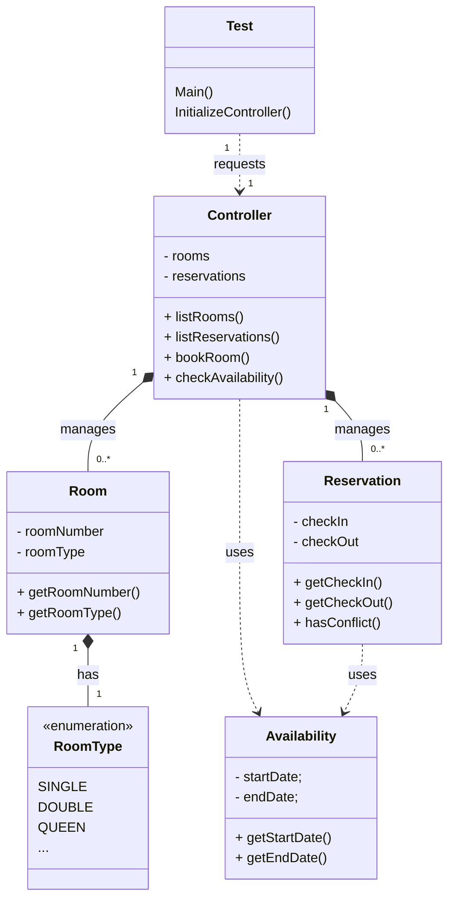

```mermaid
classDiagram

class Test{
Main()
InitializeController()
}

class Controller{
- rooms
- reservations
+ listRooms()
+ listReservations()
+ bookRoom()
+ checkAvailability()
}

class Room{
- roomNumber
- roomType
+ getRoomNumber()
+ getRoomType()
}

class RoomType{
<<enumeration>>
SINGLE
DOUBLE
QUEEN
...
}

class Reservation{
- checkIn
- checkOut
+ getCheckIn()
+ getCheckOut()
+ hasConflict()
}

class Availability{
- startDate;
- endDate;
+ getStartDate()
+ getEndDate()
}

Test "1" ..> "1" Controller : requests
Controller "1" *-- "0..*" Room : manages
Controller "1" *-- "0..*" Reservation : manages
Controller ..> Availability : uses
Room "1" *-- "1" RoomType : has
Reservation  ..>  Availability : uses
```