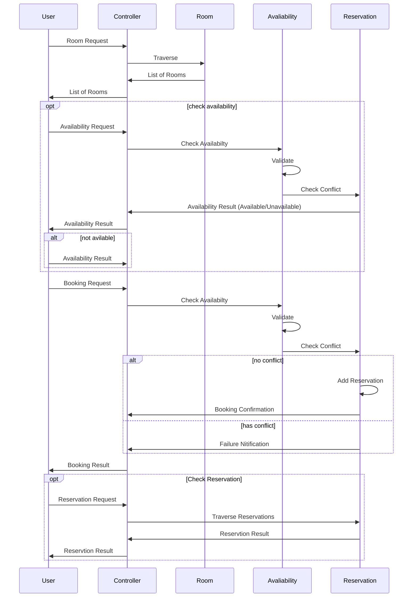

```mermaid
sequenceDiagram
User->>Controller: Room Request
Controller->>Room: Traverse
Room->>Controller: List of Rooms
Controller->>User: List of Rooms
opt check availability
User->>Controller: Availability Request
Controller->>Avaliability: Check Availabilty
Avaliability->>Avaliability: Validate
Avaliability->>Reservation: Check Conflict
Reservation->>Controller: Availability Result (Available/Unavailable)
Controller->>User: Availability Result
alt not avilable
User->>Controller: Availability Result
end
end
User->>Controller: Booking Request
Controller->>Avaliability: Check Availabilty
Avaliability->>Avaliability: Validate
Avaliability->>Reservation: Check Conflict
alt no conflict
Reservation->>Reservation: Add Reservation
Reservation->>Controller: Booking Confirmation
else has conflict
Reservation->>Controller: Failure Nitification
end
Controller->>User: Booking Result
opt Check Reservation
User->>Controller: Reservation Request
Controller->>Reservation: Traverse Reservations
Reservation->>Controller: Reservtion Result
Controller->>User: Reservtion Result
end
```